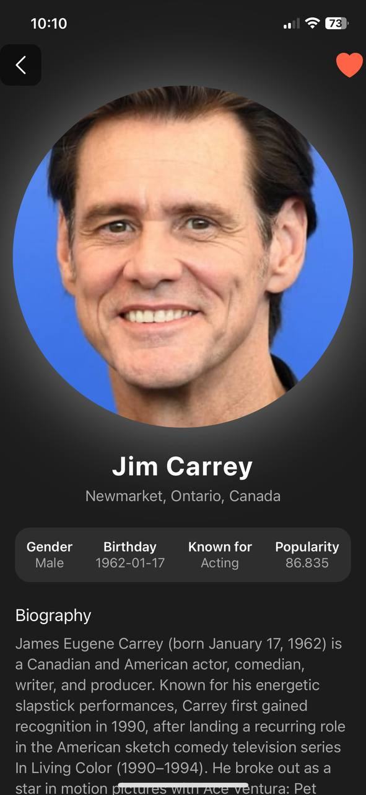

# Movie App - Hybrid Mobile Application Development [Semester 7]

A mobile application built using **React Native** that allows users to explore movies and actors. With the app, users can search for movies, view movie details, and like movies and actors. They can also access their liked movies and actors in dedicated sections. The app utilizes **The Movie Database (TMDb)** API to fetch movie and actor data.

## Features

- **Search Movies**: Users can search for any movie by title.
- **Movie Categories**: View trending movies, upcoming movies, and top-rated movies.
- **Movie Details**: View detailed information about each movie, including title, genre, release date, runtime, and more.
- **Like Movies**: Users can like movies and add them to their "Liked Movies" list.
- **Like Actors**: Users can like actors and add them to their "Liked Actors" list.
- **Liked Movies & Actors**: Users can view their liked movies and actors in separate sections.
- **Actor Details**: View full details of an actor, including their filmography.

## Screenshots

  
*Home Screen showing the app's main menu.*
<br/>
<br/>
<br/>

  
*Movie Details showing detailed information about a specific movie and you can also like the movie.*
<br/>
<br/>
<br/>


  
*Movie Details also shows casts of that movie and similar movies.*
<br/>
<br/>
<br/>


  
*Actors Screen shows details filmography of the actor and you can also like the actor.*
<br/>
<br/>
<br/>

  
*Actors Screen also shows all of the movies of the actor.*
<br/>
<br/>
<br/>

  
*In Search Screen, you can search for movies by title.*
<br/>
<br/>
<br/>


  
*In Liked Movies screen, users can see their liked movies.*
<br/>
<br/>
<br/>

  
*In Liked Actors screen, users can see their liked acotrs.*
<br/>
<br/>
<br/>


## Technologies Used

- **React Native**: Cross-platform framework for building mobile apps.
- **TMDb API**: The Movie Database API to fetch movie and actor data.
- **AsyncStorage**: For storing liked movies and actors locally on the device.
- **React Navigation**: To handle app navigation.
- **Expo**: For building and running the app with ease.

## API Usage

This app uses the **The Movie Database (TMDb)** API to fetch movie and actor data. The API provides information such as:

- **Movie details**: Title, release date, genres, cast, and more.
- **Trending Movies**: A list of popular movies at the moment.
- **Upcoming Movies**: Movies that will be released soon.
- **Top-Rated Movies**: A list of movies with the highest ratings.
- **Actor details**: Actor bio, filmography, and profile images.

You can learn more about the TMDb API [here](https://www.themoviedb.org/).

## Prerequisites

Before running the app, ensure you have the following installed:

- **Node.js**: Make sure you have Node.js installed. You can download it from [here](https://nodejs.org/).
- **Expo CLI**: If you haven't installed Expo CLI, install it globally using:

```bash
npm install -g expo-cli
```

## Getting Started

1. **Clone the Repository**

   Clone this repository to your local machine using Git:

   ```bash
   git clone https://github.com/yourusername/movie-app.git
   cd movie-app
   ```

2. **Install Dependencies**

   Once you've cloned the repository, install the required dependencies:

   ```bash
   npm install
   ```

3. **Set up TMDb API Key**

   To interact with the TMDb API, you need an API key. Follow these steps to get your API key:

   - Go to [TMDb](https://www.themoviedb.org/).
   - Sign up or log in to your account.
   - Navigate to your account settings and find the API section to generate your key.

   Once you have the API key, create a `.env` file in the root of the project and add the following:

   ```
   REACT_APP_TMDB_API_KEY=your_api_key_here
   ```

4. **Running the App**

   After setting up everything, start the app using Expo:

   ```bash
   expo start
   ```

   This will start the development server. You can then open the app in the Expo Go app on your mobile device or use an Android/iOS simulator.

## Features Overview

### Home Screen

- Displays the main menu with options to view **Trending Movies**, **Upcoming Movies**, and **Top-Rated Movies**.
- Allows users to search for movies by title.

### Movie Details Screen

- Shows detailed information about a movie, including title, release date, runtime, and more.
- Users can add movies to their liked list.

### Liked Movies Screen

- Displays all movies that the user has liked.
- Users can unlike a movie, which removes it from their liked list.

### Liked Actors Screen

- Displays all actors that the user has liked.
- Users can unlike an actor, which removes them from their liked list.

### Actor Details Screen

- Shows detailed information about an actor, including their biography, profile image, and a list of movies they’ve starred in.

## Contributing

If you'd like to contribute to this project, feel free to fork the repository, make your changes, and submit a pull request. Contributions are always welcome!

## License

This project is licensed under the MIT License - see the [LICENSE](LICENSE) file for details.

## Contact

For any questions or feedback, please feel free to reach out to [your email address].
